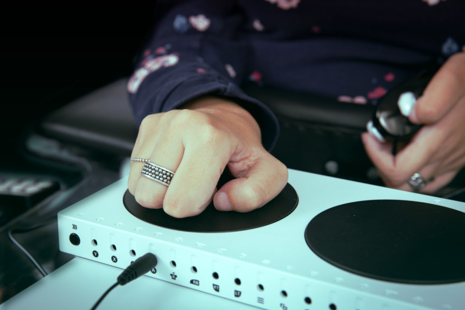

# μSwitch

μSwitch is a cross-platform application which enables musicians to play sounds using switches. It's designed for people with disabilities to help them practise playing music and to perform in a concert.

Switch interface devices send gamepad, keyboard or mouse signals to personal computers. For example, a switch interface could be configured to send a specific gamepad button to the computer whenever a switch is pressed. μSwitch will then play sounds based on these signals.

One example of such a switch interface device, is the [Xbox Adaptive Controller](https://www.xbox.com/en-US/accessories/controllers/xbox-adaptive-controller). It connects to a computer using USB or Bluetooth. A switch can be assigned to a gamepad button, by plugging the switch into one of the fourteen 3.5 mm jack ports.



μSwitch may be configured to play a specific or random flac, mp3, ogg, or PCM wav file whenever a specific gamepad button, keyboard key or button on the GUI is pressed.

## Use case

An important use case for this application is the ability to easily send it to someone, completely preconfigured. For example, at the [My Breath My Music](https://mybreathmymusic.com/) foundation we offer a lending program 
for people with disabilities. In this lending program we try to determine what kind of hardware someone needs, and then ship it to them. The μSwitch application is also sent to them, preconfigured to their specific set of hardware.

μSwitch is written in [Rust](https://www.rust-lang.org/), which makes it very easy to create native applications for different platforms (e.g. Windows, macOS, Linux). There is no need for the user to first install a runtime or shared library. A configuration file must be placed in the same filesystem directory as the binary executable. This configuration file specifies which sound to play after a button or switch is pressed. 

The end-user only has to connect his switch interface and open the program. They can then immediately begin playing.

## Getting started
There are three ways to get this application to work on your computer:

### 1. Download a release
You can download a zip file that contains everything you need to get started from the [releases page](https://github.com/Joris-van-der-Wel/microswitch/releases). Simply locate the latest version listen and download the zip that is appropriate for your platform. These zip files also contain sample configuration and sounds. Simply unzip all the files, and launch the binary.

### 2. Install using cargo
This application is also published on [crates.io](https://crates.io/). You can use the `cargo` command to automatically build and install binaries from crates.io.

First, [install rust](https://www.rust-lang.org/tools/install). Then, you can install this application by running `cargo install microswitch` in a command line terminal. 

μSwitch requires a configuration file for it to work. In the [example](https://github.com/Joris-van-der-Wel/microswitch/tree/master/example) directory you can find an example configuration file and CC0 sounds.

To start using the application, run from the terminal: `microswitch path/to/config.yaml`.

### 3. Build it yourself
First, [install rust](https://www.rust-lang.org/tools/install).

Secondly, clone this project:

```
git clone https://github.com/Joris-van-der-Wel/microswitch.git
```

Thirdly, build the executable binary by running:

```
cd microswitch
cargo build --bins --release
```

The binary is then found at `target/release/microswitch` or `target\release\microswitch.exe`.

μSwitch requires a configuration file for it to work. The path to this file may be specified on the command line. 

For example (Linux/macOS):

```
./target/release/microswitch example/config.yaml
``` 

On Windows this would be:

```
.\target\release\microswitch.exe example\config.yaml
```

If this path is _not_ specified it will look for `config.yaml` in the same directory as the executable.

The specified paths to the sound samples are relative to the directory the configuration file is in.
